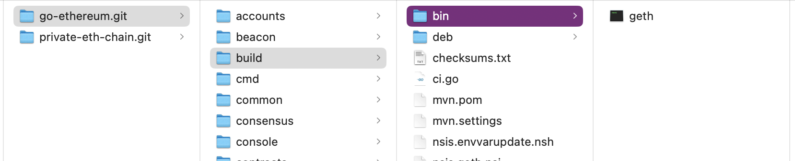
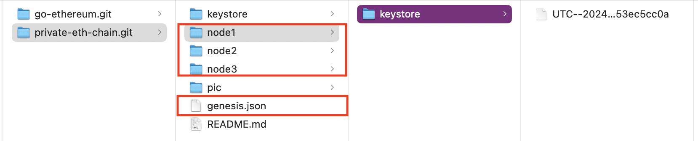
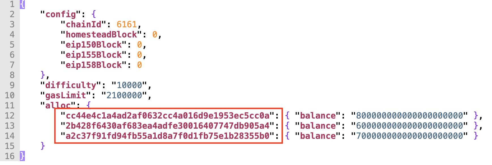
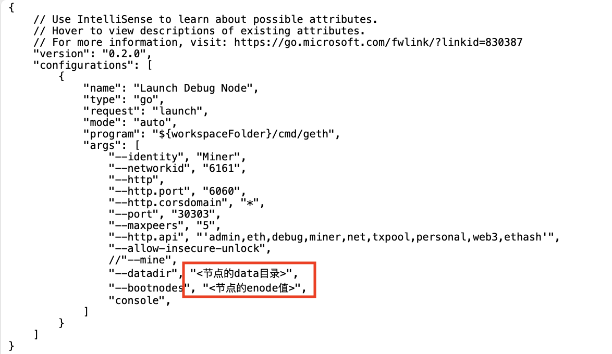
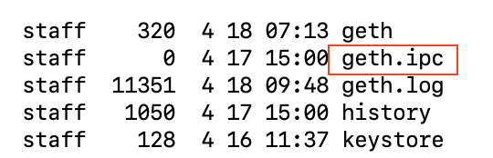

# private-eth-chain
demonstrate how to run ethereum private chain

https://www.cnblogs.com/wkfvawl/p/11211600.html

另外，这里采用的是go-ethereum的1.10.7版本的代码。

## 准备工作
新建一个文件夹，然后执行clone命令：

```
git clone https://github.com/ethereum/go-ethereum.git go-ethereum.git 
git clone https://github.com/victorxcl/private-eth-chain.git private-eth-chain.git
```

然后进入go-ethereun.git文件夹，切换到分支1.10：
```
git checkout release/1.10
```

最后，我们build以太坊命令行工具：
```
make geth
```

编译之后的geth的位置：


我们的私链文件夹结构如下：


1. 建立三个节点文件夹：node1, node2, node3。

2. 在每个文件夹里面新建了一个account（该account默认会成为矿工的coinbase）。

3. 为了尽量减少对后面脚本的修改，我预制了三个account，
   所有的account的password都是: **123456**
   
4. 如果不想使用预制的account，可以按照如下的脚本自己创建：
    ```
    ../go-ethereum.git/build/bin/geth --datadir node1 account new
    ../go-ethereum.git/build/bin/geth --datadir node2 account new
    ../go-ethereum.git/build/bin/geth --datadir node3 account new
    ```
    - 后面，就需要修改对应的account地址了（包括genesis.json里面的预分配代币的account地址）。
    

   - 检测创建account是否成功：
        ```
        ../go-ethereum.git/build/bin/geth --datadir node1 account list
        ../go-ethereum.git/build/bin/geth --datadir node2 account list
        ../go-ethereum.git/build/bin/geth --datadir node3 account list
        ```

## 在private-eth-chain.git文件夹里面对三个node执行初始化：
```
../go-ethereum.git/build/bin/geth --datadir node1 init genesis.json
../go-ethereum.git/build/bin/geth --datadir node2 init genesis.json
../go-ethereum.git/build/bin/geth --datadir node3 init genesis.json
```

## 启动第一个节点，也是我们的挖矿节点：

```
../go-ethereum.git/build/bin/geth \
    --identity "node1" \
    --datadir node1 \
    --networkid 6161 \
    --http \
    --http.port "3031" \
    --http.corsdomain "*" \
    --port "30313" \
    --maxpeers 5 \
    --syncmode full \
    --http.api "admin,eth,debug,miner,net,txpool,personal,web3,ethash " \
    --allow-insecure-unlock \
    console 2>node1/geth.log
```

```--allow-insecure-unlock```参数表示可以通过HTTP协议解锁account（我们的测试私链，不想整复杂的HTTPS）。

注意上面的输出重定向到了各自节点的geth.log文件里面。可以通过：

```
tail -f geth.log
```
来动态查看最近的输出。之所以这么做，是为了将console和log输出分开，避免混杂在一起。
后面的两个节点，也要这么做。

启动之后，键入下面的命令：
```
admin.nodeInfo.enode
```
获得该节点的enode值（**确保enode的IP是127.0.0.1网段**），后面需要用到。


enode值长相如下所示：
```
"enode://db13635cf83cd57047446cdf2f884a7d0c622593c0d40004db52878a365d1314e3160585d5128f32ce7b5a27ec5cd0cf90db37fc821593af6a9f5c5e3024d65d@127.0.0.1:30313"
```


## 启动第二个节点（需要用到第一个节点的enode值）：
```
../go-ethereum.git/build/bin/geth \
    --identity "node2" \
    --datadir node2 \
    --networkid 6161 \
    --http \
    --http.port "3032" \
    --http.corsdomain "*" \
    --port "30323" \
    --maxpeers 5 \
    --syncmode full \
    --http.api "admin,eth,debug,miner,net,txpool,personal,web3,ethash " \
    --allow-insecure-unlock \
    --bootnodes "<第一个节点的enode值>" \
    console 2>node2/geth.log
```
记得替换--bootnodes的参数为第一个节点的enode值。

该节点启动成功后，在node1的console里面输入命令：
```
net.peerCount
```
来查询当前的peer的数量，大于零表示各个节点找到对方了。

## 启动第三个节点（需要用到第一个节点的enode值）：
```
../go-ethereum.git/build/bin/geth \
    --identity "node3" \
    --datadir node3 \
    --networkid 6161 \
    --http \
    --http.port "3033" \
    --http.corsdomain "*" \
    --port "30333" \
    --maxpeers 5 \
    --syncmode full \
    --http.api "admin,eth,debug,miner,net,txpool,personal,web3,ethash " \
    --allow-insecure-unlock \
    --bootnodes "<第一个节点的enode值>" \
    console 2>node3/geth.log
```

记得替换--bootnodes的参数为第一个节点的enode值。

该节点启动成功后，在node1的console里面输入命令：
```
net.peerCount
```
来查询当前的peer的数量，大于零表示各个节点找到对方了。

最后，在node1的console里面输入命令：
```
admin.peers
```
这样会列出所有的peers。

[!NOTE]
如果多个node之间迟迟不能建立连接(也就是peerCount始终为0)，那么可以（Walk Around）通过：

1. 模拟一次转账交易
2. 并在交易节点本地挖矿

之后，就会构建DAG，然后peerCount数量就正确了：）

## 对三个节点的私有链进行简单的测试

某个节点中的所有account列表：
```
eth.accounts
```

获取三个账户的余额（单位为wei）
```
eth.getBalance("cc44e4c1a4ad2af0632cc4a016d9e1953ec5cc0a")
```
```
eth.getBalance("2b428f6430af683ea4adfe30016407747db905a4")
```
```
eth.getBalance("a2c37f91fd94fb55a1d8a7f0d1fb75e1b28355b0")
```

单位从wei换算为ether（以太币）：
```
web3.fromWei(eth.getBalance("cc44e4c1a4ad2af0632cc4a016d9e1953ec5cc0a"),'ether')
```
```
web3.fromWei(eth.getBalance("2b428f6430af683ea4adfe30016407747db905a4"),'ether')
```
```
web3.fromWei(eth.getBalance("a2c37f91fd94fb55a1d8a7f0d1fb75e1b28355b0"),'ether')
```

尝试从node3的account转账到node2的account：

在node3的console转账之前需要先解锁账户，我们用的是HTTP协议，所以需要```--allow-insecure-unlock```避免解锁失败：
```
personal.unlockAccount(eth.accounts[0])
```

在node3的console执行发送转账transaction：
```
eth.sendTransaction({from:"0xa2c37f91fd94fb55a1d8a7f0d1fb75e1b28355b0",to:"0x2b428f6430af683ea4adfe30016407747db905a4",value:web3.toWei(5,'ether')})
```

在node3的console查询txpool状态：
```
txpool.status
```

在node1的console依次执行命令：
```
txpool.status
```
```
miner.start(1);admin.sleepBlocks(1);miner.stop();
```
```
eth.getBlock(1)
```

转账成功之后，再次查询三个账户的余额：
```
web3.fromWei(eth.getBalance("cc44e4c1a4ad2af0632cc4a016d9e1953ec5cc0a"),'ether')
```
```
web3.fromWei(eth.getBalance("2b428f6430af683ea4adfe30016407747db905a4"),'ether')
```
```
web3.fromWei(eth.getBalance("a2c37f91fd94fb55a1d8a7f0d1fb75e1b28355b0"),'ether')
```

## 调试
1. 启动。采用launch.json的形式（在本git仓库里面将其重命名为debugger.json，避免直接使用）

    

注意替换上图中的必须手动指定的**两个参数**。

2. 找到```geth.ipc```的路径，如图所示：

    

在VSC(Visual Studio Code)启动调试器后，在VSC的Terminal里面再执行命令：
```
./build/bin/geth attach <your-path>/geth.ipc
```

这样之后，就可以输入调试命令了。